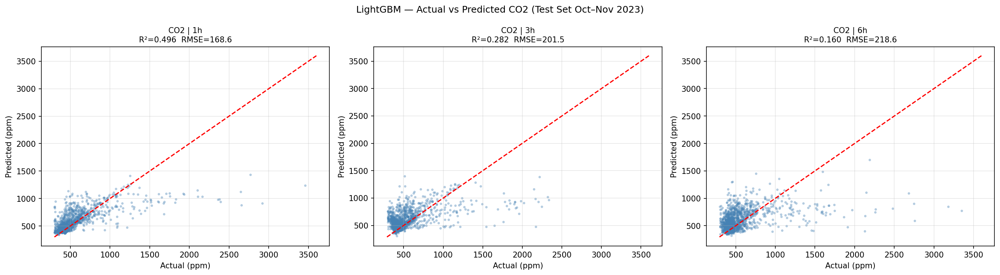
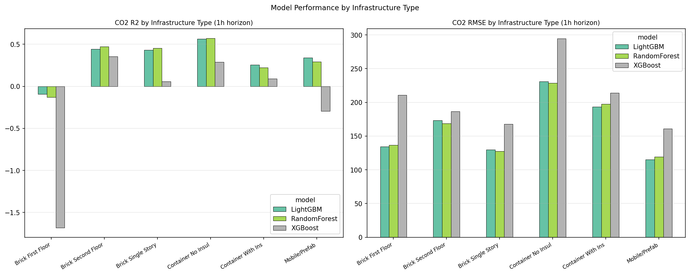

# 🌬️ BreatheEasy — Indoor Air Quality Dashboard

> **Live app → [breathe-easy.streamlit.app](https://breathe-easy.streamlit.app)**  
> ML-powered CO₂ forecasting for South African primary school classrooms.

[](https://breathe-easy.streamlit.app)


---

## What it does

BreatheEasy predicts whether the air quality in a South African school classroom is about to become unsafe — up to **6 hours ahead** — using LightGBM models trained on 372,084 sensor readings from 49 devices across 249 days.

**Two functions:**

| Feature | Description |
|---|---|
| 🏫 Room Forecast | Pick a classroom, date, and time → see CO₂ now + AI predictions at 11 min, 33 min, 1h, 3h, 6h with plain-language action advice |
| 📊 Infra Compare | Compare CO₂ warning rates across all 6 classroom infrastructure types to identify which buildings need ventilation improvements most |

CO₂ above **1,000 ppm** causes reduced concentration. Above **2,000 ppm** requires immediate action.

---

## Screenshots

| Room Forecast | Infrastructure Comparison |
|---|---|
|  |  |

---

## Research context

This app is the applied output of a dissertation studying IAQ prediction in South African primary schools across **6 infrastructure types** (Brick First Floor, Brick Second Floor, Brick Single Story, Container No Insulation, Container With Insulation, Mobile/Prefab).

**Key results:**

| Target | Horizon | Best Model | R² |
|---|---|---|---|
| CO₂ | 11 min | LightGBM | 0.899 |
| CO₂ | 1 h | Ridge LR | 0.514 |
| PM₂.₅ | 1 h | RF-LSTM | 0.592 |
| PM₂.₅ | 6 h | LSTM | 0.153 |

Full results in [`results/all_results.csv`](results/all_results.csv). Statistical validation via Diebold-Mariano tests in [`results/dm_tests.csv`](results/dm_tests.csv).

> **Dataset:** Mendeley Data — *Indoor air quality measurements in South African primary school classrooms* (DOI: [10.17632/tys2gscdv7.6](https://doi.org/10.17632/tys2gscdv7.6))

---

## Repo structure

```
├── app.py                  # Streamlit application
├── requirements.txt        # Dependencies
├── notebooks/              # Full ML pipeline (Colab notebook)
├── results/
│   ├── all_results.csv     # R², MAE, RMSE, MAPE — all models × all horizons
│   └── dm_tests.csv        # Diebold-Mariano statistical test results
├── figures/                # EDA and evaluation plots
└── .hf_cache/              # Auto-populated model cache from Hugging Face
```

Models and processed data are hosted on [Hugging Face](https://huggingface.co/datasets/mufliha/iaq-prediction) and cached locally on first load. The raw dataset is not included — download from Mendeley using the DOI above.

---

## Run locally

```bash
git clone https://github.com/YOUR_USERNAME/breathe-easy.git
cd breathe-easy
pip install -r requirements.txt
streamlit run app.py
```

On first run the app downloads ~200 MB of model files and processed data from Hugging Face. Subsequent runs load from `.hf_cache/`.

---

## Models

Five LightGBM models — one per forecast horizon — trained on 119,253 samples with 70 engineered features including lag values, rolling statistics, cyclical temporal encodings, school schedule flags, and infrastructure metadata. Scaled with MinMaxScaler fitted on the training partition only.

| Horizon | Model file |
|---|---|
| 11 min | `LightGBM_Measured_CO2_11min.pkl` |
| 33 min | `LightGBM_Measured_CO2_33min.pkl` |
| 1 h | `LightGBM_Measured_CO2_1h.pkl` |
| 3 h | `LightGBM_Measured_CO2_3h.pkl` |
| 6 h | `LightGBM_Measured_CO2_6h.pkl` |

---

## Dependencies

```
streamlit>=1.32
pandas>=2.0
numpy>=1.26
plotly>=5.0
scikit-learn>=1.4
lightgbm>=4.0
requests>=2.31
pyarrow>=14.0
```

---

## Dissertation

**Title:** BreatheEasy — A Machine Learning Framework for Multi-Pollutant Indoor Air Quality Prediction in South African School Classrooms  
**Institution:** Heriot-Watt University  
**Student Name:** Mufliha Dawood
**Supervisor:** Dr. Drishty Sobnath
**Year:** 2026
